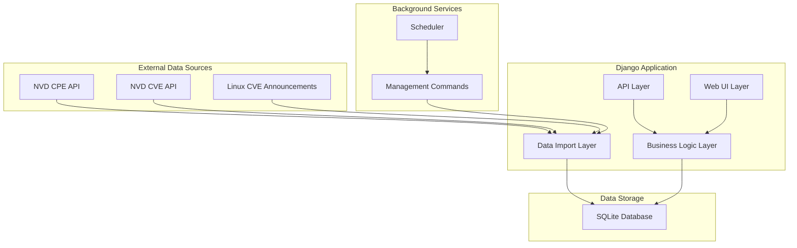
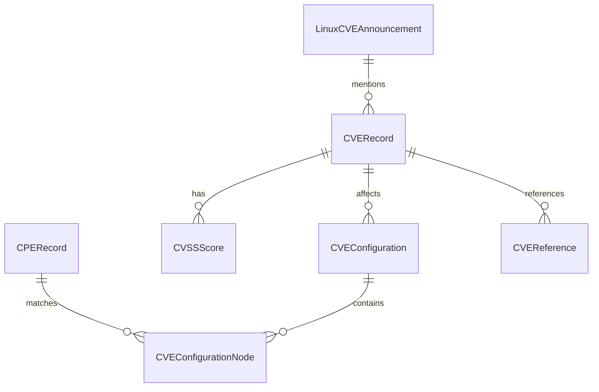

# Design Document

## Overview

The Django-based vulnerability management dashboard is designed as a modular, extensible web application that serves as a local repository for security information from multiple sources. The system follows Django best practices with a clear separation of concerns across three main applications: CPE Repository, CVE Repository, and Linux CVE Announcements Repository.

The architecture emphasizes data integrity, performance optimization for large datasets, and extensibility for future data sources. The system uses SQLite for simplicity and portability, Django REST Framework for API endpoints, and AdminLTE for a professional web interface.

## Architecture

### High-Level Architecture



### Application Structure

```
vulnerability_dashboard/
├── manage.py
├── requirements.txt
├── vulnerability_dashboard/
│   ├── __init__.py
│   ├── settings/
│   │   ├── __init__.py
│   │   ├── base.py
│   │   ├── development.py
│   │   └── production.py
│   ├── urls.py
│   └── wsgi.py
├── apps/
│   ├── __init__.py
│   ├── core/
│   │   ├── __init__.py
│   │   ├── models.py
│   │   ├── utils.py
│   │   ├── pagination.py
│   │   └── management/
│   ├── cpe_repository/
│   │   ├── __init__.py
│   │   ├── models.py
│   │   ├── views.py
│   │   ├── serializers.py
│   │   ├── urls.py
│   │   ├── services.py
│   │   └── management/
│   ├── cve_repository/
│   │   ├── __init__.py
│   │   ├── models.py
│   │   ├── views.py
│   │   ├── serializers.py
│   │   ├── urls.py
│   │   ├── services.py
│   │   └── management/
│   └── linux_cve_announcements/
│       ├── __init__.py
│       ├── models.py
│       ├── views.py
│       ├── serializers.py
│       ├── urls.py
│       ├── services.py
│       └── management/
├── templates/
│   ├── base.html
│   ├── dashboard.html
│   └── apps/
└── static/
    ├── css/
    ├── js/
    └── adminlte/
```

## Components and Interfaces

### Core Components

#### 1. Base Models (apps/core/models.py)
```python
class TimestampedModel(models.Model):
    """Abstract base model with timestamp fields"""
    created_at = models.DateTimeField(auto_now_add=True)
    updated_at = models.DateTimeField(auto_now=True)
    
    class Meta:
        abstract = True

class ImportLog(TimestampedModel):
    """Track import operations"""
    source = models.CharField(max_length=50)
    operation = models.CharField(max_length=20)
    status = models.CharField(max_length=20)
    records_processed = models.IntegerField(default=0)
    error_message = models.TextField(blank=True)
```

#### 2. API Client Service (apps/core/utils.py)
```python
class NVDAPIClient:
    """Handles NVD API interactions with rate limiting"""
    
    def __init__(self, api_key=None):
        self.api_key = api_key
        self.rate_limit = 5 if not api_key else 50  # requests per 30 seconds
        self.session = requests.Session()
    
    def get_cpes(self, start_index=0, results_per_page=2000):
        """Fetch CPE data with pagination"""
        
    def get_cves(self, start_index=0, results_per_page=2000, **filters):
        """Fetch CVE data with pagination and filtering"""
        
    def _handle_rate_limit(self):
        """Implement rate limiting logic"""
```

#### 3. Data Import Services
Each app will have a dedicated service class for handling data import:

```python
class CPEImportService:
    """Handles CPE data import and updates"""
    
    def full_import(self):
        """Perform initial full import"""
        
    def incremental_update(self):
        """Update with recent changes"""
        
    def _process_cpe_batch(self, cpe_data):
        """Process a batch of CPE records"""
```

### CPE Repository Models

```python
class CPERecord(TimestampedModel):
    """CPE Dictionary entry"""
    cpe_name = models.CharField(max_length=500, unique=True, db_index=True)
    cpe_name_id = models.CharField(max_length=100, unique=True)
    part = models.CharField(max_length=1)  # a, o, h
    vendor = models.CharField(max_length=200, db_index=True)
    product = models.CharField(max_length=200, db_index=True)
    version = models.CharField(max_length=100, blank=True)
    update = models.CharField(max_length=100, blank=True)
    edition = models.CharField(max_length=100, blank=True)
    language = models.CharField(max_length=10, blank=True)
    sw_edition = models.CharField(max_length=100, blank=True)
    target_sw = models.CharField(max_length=100, blank=True)
    target_hw = models.CharField(max_length=100, blank=True)
    other = models.CharField(max_length=100, blank=True)
    deprecated = models.BooleanField(default=False)
    deprecated_by = models.JSONField(blank=True, null=True)
    
    class Meta:
        indexes = [
            models.Index(fields=['vendor', 'product']),
            models.Index(fields=['part', 'vendor']),
        ]
```

### CVE Repository Models

```python
class CVERecord(TimestampedModel):
    """CVE vulnerability record"""
    cve_id = models.CharField(max_length=20, unique=True, db_index=True)
    source_identifier = models.CharField(max_length=100)
    published = models.DateTimeField(db_index=True)
    last_modified = models.DateTimeField(db_index=True)
    vuln_status = models.CharField(max_length=50)
    description = models.TextField()
    
    class Meta:
        indexes = [
            models.Index(fields=['published']),
            models.Index(fields=['last_modified']),
        ]

class CVSSScore(models.Model):
    """CVSS scoring information"""
    cve = models.ForeignKey(CVERecord, on_delete=models.CASCADE, related_name='cvss_scores')
    version = models.CharField(max_length=10)  # 2.0, 3.0, 3.1, 4.0
    vector_string = models.CharField(max_length=200)
    base_score = models.DecimalField(max_digits=3, decimal_places=1, db_index=True)
    base_severity = models.CharField(max_length=20, db_index=True)
    exploitability_score = models.DecimalField(max_digits=3, decimal_places=1, null=True)
    impact_score = models.DecimalField(max_digits=3, decimal_places=1, null=True)

class CVEConfiguration(models.Model):
    """CPE configurations affected by CVE"""
    cve = models.ForeignKey(CVERecord, on_delete=models.CASCADE, related_name='configurations')
    operator = models.CharField(max_length=10)  # AND, OR
    negate = models.BooleanField(default=False)
    
class CVEConfigurationNode(models.Model):
    """Individual CPE match criteria"""
    configuration = models.ForeignKey(CVEConfiguration, on_delete=models.CASCADE, related_name='nodes')
    cpe_match = models.CharField(max_length=500)
    vulnerable = models.BooleanField(default=True)
    version_start_including = models.CharField(max_length=100, blank=True)
    version_start_excluding = models.CharField(max_length=100, blank=True)
    version_end_including = models.CharField(max_length=100, blank=True)
    version_end_excluding = models.CharField(max_length=100, blank=True)

class CVEReference(models.Model):
    """External references for CVE"""
    cve = models.ForeignKey(CVERecord, on_delete=models.CASCADE, related_name='references')
    url = models.URLField()
    source = models.CharField(max_length=100)
    tags = models.JSONField(default=list)
```

### Linux CVE Announcements Models

```python
class LinuxCVEAnnouncement(TimestampedModel):
    """Linux CVE announcement from mailing list"""
    message_id = models.CharField(max_length=200, unique=True, db_index=True)
    subject = models.CharField(max_length=500)
    sender = models.EmailField()
    date = models.DateTimeField(db_index=True)
    cve_ids = models.JSONField(default=list)  # List of CVE IDs mentioned
    content = models.TextField()
    raw_message = models.TextField()
    
    class Meta:
        indexes = [
            models.Index(fields=['date']),
            models.Index(fields=['sender']),
        ]
```

## Data Models

### Database Design Considerations

1. **Indexing Strategy**: Critical fields like CVE IDs, CPE names, dates, and severity scores are indexed for fast queries
2. **Normalization**: Related data is properly normalized to avoid duplication while maintaining query performance
3. **JSON Fields**: Used for flexible data like CVE references tags and deprecated CPE lists
4. **Timestamps**: All models inherit timestamp tracking for audit purposes

### Data Relationships



## Correctness Properties

*A property is a characteristic or behavior that should hold true across all valid executions of a system-essentially, a formal statement about what the system should do. Properties serve as the bridge between human-readable specifications and machine-verifiable correctness guarantees.*

### Property Reflection

After analyzing all acceptance criteria, I identified several areas where properties can be consolidated:

- **Data Import Properties**: Multiple requirements about importing from different sources can be combined into comprehensive import validation properties
- **API Endpoint Properties**: Requirements for search, list, and detail endpoints across data types can be consolidated into universal API behavior properties  
- **UI Interface Properties**: Search and browsing requirements across different data types can be combined into universal UI behavior properties
- **Scheduling Properties**: Update scheduling requirements across different data sources can be consolidated
- **Data Storage Properties**: Requirements about storing different types of data can be combined into universal data persistence properties

### Core Properties

Property 1: **Data Import API Integration**
*For any* data source (CPE, CVE, Linux announcements), when the importer fetches data from the corresponding API endpoint, it should successfully retrieve and process the data according to the API specification
**Validates: Requirements 3.1, 4.1, 5.1**

Property 2: **Import Pagination Handling**
*For any* large dataset import operation, the system should correctly handle pagination by using appropriate parameters (resultsPerPage, startIndex) and process all available data
**Validates: Requirements 3.2, 4.2**

Property 3: **Data Storage Normalization**
*For any* imported record (CPE, CVE, or announcement), the system should store it in normalized form in the SQLite database with all required fields properly populated
**Validates: Requirements 3.3, 4.3, 4.4, 4.5, 4.6, 5.3**

Property 4: **Scheduled Update Execution**
*For any* configured data source, the scheduler should perform automatic updates at the specified intervals without manual intervention
**Validates: Requirements 3.5, 4.8, 5.5**

Property 5: **Search Interface Functionality**
*For any* data type (CPE, CVE, Linux announcements), the system should provide a working search interface that returns relevant results based on user queries
**Validates: Requirements 2.3, 3.7, 4.11**

Property 6: **Detail View Accessibility**
*For any* individual record in the system, there should be a detail page that displays complete information about that record
**Validates: Requirements 2.4**

Property 7: **Pagination Implementation**
*For any* large dataset view (web UI or API), the system should implement pagination that allows users to navigate through all available data
**Validates: Requirements 2.5, 6.5**

Property 8: **Filtering Capability**
*For any* data type, the system should provide filtering capabilities that allow users to narrow down results based on relevant criteria
**Validates: Requirements 2.6, 4.10, 6.6**

Property 9: **REST API Endpoint Coverage**
*For any* data type in the system, there should be corresponding REST API endpoints for search, list, and detail operations
**Validates: Requirements 3.8, 4.12, 5.7, 6.2, 6.3, 6.4**

Property 10: **Email Parsing Accuracy**
*For any* Linux CVE announcement email, the parser should extract structured data including CVE IDs, sender, date, and content
**Validates: Requirements 5.2**

Property 11: **Management Command Functionality**
*For any* data update operation, there should be a corresponding Django management command that can be executed independently
**Validates: Requirements 7.1**

Property 12: **Activity Logging**
*For any* import or update operation, the system should create detailed log entries with operation status, records processed, and any errors encountered
**Validates: Requirements 7.5, 8.4**

Property 13: **Rate Limit Handling**
*For any* API request that encounters rate limiting, the system should handle it gracefully by implementing appropriate delays and retry logic
**Validates: Requirements 7.6, 8.3**

Property 14: **Configuration Externalization**
*For any* configurable system parameter, it should be accessible through environment variables rather than hard-coded values
**Validates: Requirements 8.2**

Property 15: **Data Validation**
*For any* external data before storage, the system should validate it against expected schemas and reject invalid data
**Validates: Requirements 8.5**

<function_calls>
<invoke name="prework">
<parameter name="featureName">vulnerability-management-dashboard

## Error Handling

### API Error Handling

1. **Rate Limiting**: Implement exponential backoff when NVD API rate limits are hit
2. **Network Failures**: Retry logic with configurable attempts and delays
3. **Data Validation**: Comprehensive validation of API responses before processing
4. **Partial Failures**: Continue processing when individual records fail, log errors

### Database Error Handling

1. **Constraint Violations**: Handle unique constraint violations gracefully during imports
2. **Transaction Management**: Use database transactions for batch operations
3. **Connection Failures**: Implement connection pooling and retry logic
4. **Data Integrity**: Validate foreign key relationships before saving

### User Interface Error Handling

1. **Search Errors**: Display user-friendly messages for failed searches
2. **Pagination Errors**: Handle invalid page numbers gracefully
3. **Detail View Errors**: Show appropriate 404 pages for missing records
4. **Form Validation**: Client-side and server-side validation for user inputs

## Testing Strategy

### Dual Testing Approach

The system will use both unit testing and property-based testing to ensure comprehensive coverage:

**Unit Tests**: 
- Verify specific examples and edge cases
- Test integration points between components
- Validate error conditions and boundary cases
- Test specific UI components and API endpoints

**Property-Based Tests**:
- Verify universal properties across all inputs using Hypothesis (Python property-based testing library)
- Test data import operations with generated test data
- Validate API responses across different query parameters
- Ensure UI components work with various data combinations

### Property-Based Testing Configuration

- **Library**: Hypothesis for Python property-based testing
- **Test Iterations**: Minimum 100 iterations per property test
- **Test Tagging**: Each property test tagged with format: **Feature: vulnerability-management-dashboard, Property {number}: {property_text}**

### Testing Coverage Areas

1. **Data Import Testing**:
   - Unit tests for specific API response formats
   - Property tests for data normalization across various inputs
   - Integration tests for full import workflows

2. **API Testing**:
   - Unit tests for specific endpoint behaviors
   - Property tests for pagination and filtering across different datasets
   - Performance tests for large dataset handling

3. **UI Testing**:
   - Unit tests for specific page components
   - Property tests for search and filtering functionality
   - Integration tests for complete user workflows

4. **Background Job Testing**:
   - Unit tests for management command execution
   - Property tests for scheduling and error handling
   - Integration tests for complete update cycles

### Test Data Management

- **Mock Data**: Use factory_boy for generating test data
- **API Mocking**: Mock external API calls for unit tests
- **Database Testing**: Use separate test database with realistic data volumes
- **Property Generators**: Custom Hypothesis strategies for domain-specific data types (CPE names, CVE IDs, etc.)

## Deployment Architecture

### Development Environment
```
Python 3.11+ with virtualenv
Django 4.2 LTS
SQLite database file
Django development server
```

### Production Environment
```
Python 3.11+ with virtualenv
Django 4.2 LTS with production settings
SQLite database with WAL mode
Waitress WSGI server
Static files served by Waitress
```

### Cross-Platform Considerations

**Linux Deployment**:
- Use systemd service files for background scheduling
- Cron jobs for periodic updates
- Standard Python package management

**Windows Deployment**:
- Windows Service wrapper for background processes
- Task Scheduler for periodic updates
- Windows-compatible path handling

### Security Configuration

1. **Django Security Settings**:
   - CSRF protection enabled
   - Secure cookie settings
   - Content Security Policy headers
   - SQL injection protection through ORM

2. **Environment Configuration**:
   - Secret key from environment variables
   - Database path configurable
   - API keys stored securely
   - Debug mode disabled in production

3. **Data Protection**:
   - Input validation and sanitization
   - Rate limiting on API endpoints
   - Logging without sensitive data exposure

## AdminLTE Integration

### Template Structure

```html
<!-- base.html -->
<!DOCTYPE html>
<html lang="en">
<head>
    <meta charset="utf-8">
    <meta name="viewport" content="width=device-width, initial-scale=1">
    <title>Vulnerability Dashboard</title>
    
    <!-- AdminLTE CSS -->
    <link rel="stylesheet" href="">
    <link rel="stylesheet" href="">
    
    
</head>
<body class="hold-transition sidebar-mini">
    <div class="wrapper">
        
        
        
        <div class="content-wrapper">
            
        </div>
        
        
    </div>
    
    <!-- AdminLTE JS -->
    <script src=""></script>
    <script src=""></script>
    <script src=""></script>
    
    
</body>
</html>
```

### Dashboard Components

1. **Main Dashboard**: Overview cards showing record counts, recent updates, system status
2. **Data Tables**: Responsive tables with search, sort, and pagination using AdminLTE DataTables integration
3. **Search Forms**: Consistent search interfaces across all data types
4. **Detail Cards**: Structured display of individual record information
5. **Navigation**: Sidebar navigation with collapsible sections for each data source

### Static File Management

```python
# settings.py
STATIC_URL = '/static/'
STATIC_ROOT = os.path.join(BASE_DIR, 'staticfiles')

STATICFILES_DIRS = [
    os.path.join(BASE_DIR, 'static'),
    os.path.join(BASE_DIR, 'AdminLTE-3.2.0/AdminLTE-3.2.0/dist'),
    os.path.join(BASE_DIR, 'AdminLTE-3.2.0/AdminLTE-3.2.0/plugins'),
]
```

## Extensibility Framework

### Adding New Data Sources

The system is designed to easily accommodate new vulnerability data sources through a standardized pattern:

1. **Create New Django App**:
   ```bash
   python manage.py startapp new_data_source
   ```

2. **Implement Standard Components**:
   - Models inheriting from `TimestampedModel`
   - Service class for data import
   - DRF serializers and viewsets
   - Management commands for updates
   - Templates following AdminLTE patterns

3. **Register with Core System**:
   - Add to `INSTALLED_APPS`
   - Include URLs in main URL configuration
   - Add navigation items to sidebar
   - Configure scheduling for updates

### Shared Utilities

The `apps/core/` module provides reusable components:

- **Base Models**: Common fields and behaviors
- **API Client**: Rate-limited HTTP client for external APIs
- **Pagination**: Consistent pagination across all views
- **Import Logging**: Standardized logging for all import operations
- **Data Validation**: Common validation utilities

### Configuration Management

Environment-based configuration allows easy customization:

```python
# Environment Variables
NVD_API_KEY=your_api_key_here
DATABASE_PATH=/path/to/database.sqlite3
LOG_LEVEL=INFO
UPDATE_SCHEDULE_HOURS=24
RATE_LIMIT_REQUESTS=50
RATE_LIMIT_WINDOW=30
```

This design provides a solid foundation for a comprehensive vulnerability management system that can grow and adapt to new requirements while maintaining consistency and reliability.