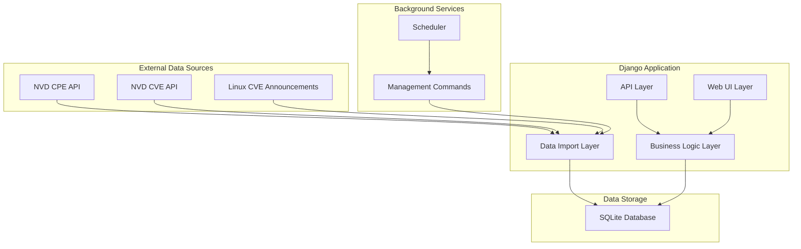
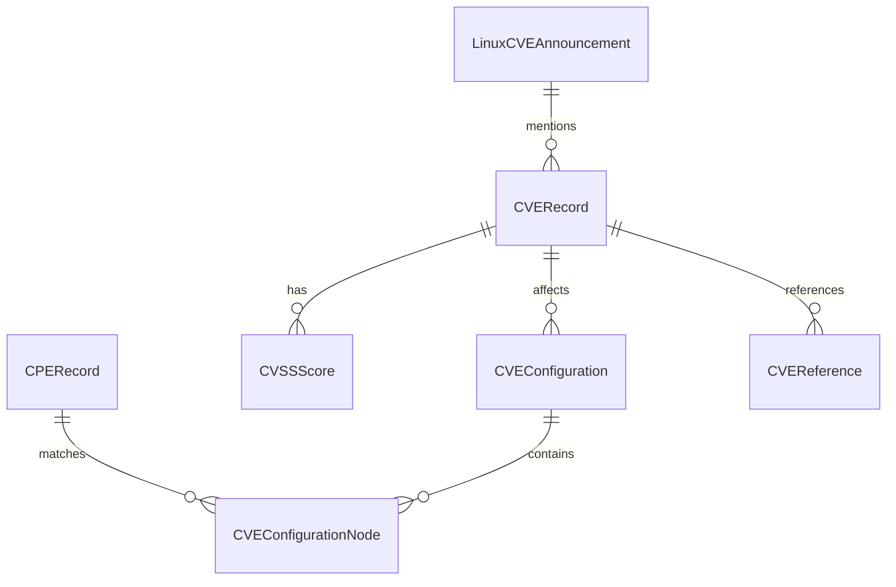

# Design Document

## Overview

The Django-based vulnerability management dashboard is designed as a modular, extensible web application that serves as a local repository for security information from multiple sources. The system follows Django best practices with a clear separation of concerns across three main applications: CPE Repository, CVE Repository, and Linux CVE Announcements Repository.

The architecture emphasizes data integrity, performance optimization for large datasets, and extensibility for future data sources. The system uses SQLite for simplicity and portability, Django REST Framework for API endpoints, and AdminLTE for a professional web interface.

## Architecture

### High-Level Architecture



### Application Structure

```
vulnerability_dashboard/
├── manage.py
├── requirements.txt
├── vulnerability_dashboard/
│   ├── __init__.py
│   ├── settings/
│   │   ├── __init__.py
│   │   ├── base.py
│   │   ├── development.py
│   │   └── production.py
│   ├── urls.py
│   └── wsgi.py
├── apps/
│   ├── __init__.py
│   ├── core/
│   │   ├── __init__.py
│   │   ├── models.py
│   │   ├── utils.py
│   │   ├── pagination.py
│   │   └── management/
│   ├── cpe_repository/
│   │   ├── __init__.py
│   │   ├── models.py
│   │   ├── views.py
│   │   ├── serializers.py
│   │   ├── urls.py
│   │   ├── services.py
│   │   └── management/
│   ├── cve_repository/
│   │   ├── __init__.py
│   │   ├── models.py
│   │   ├── views.py
│   │   ├── serializers.py
│   │   ├── urls.py
│   │   ├── services.py
│   │   └── management/
│   └── linux_cve_announcements/
│       ├── __init__.py
│       ├── models.py
│       ├── views.py
│       ├── serializers.py
│       ├── urls.py
│       ├── services.py
│       └── management/
├── templates/
│   ├── base.html
│   ├── dashboard.html
│   └── apps/
└── static/
    ├── css/
    ├── js/
    └── adminlte/
```

## Components and Interfaces

### Core Components

#### 1. Base Models (apps/core/models.py)
```python
class TimestampedModel(models.Model):
    """Abstract base model with timestamp fields"""
    created_at = models.DateTimeField(auto_now_add=True)
    updated_at = models.DateTimeField(auto_now=True)
    
    class Meta:
        abstract = True

class ImportLog(TimestampedModel):
    """Track import operations"""
    source = models.CharField(max_length=50)
    operation = models.CharField(max_length=20)
    status = models.CharField(max_length=20)
    records_processed = models.IntegerField(default=0)
    error_message = models.TextField(blank=True)
```

#### 2. API Client Service (apps/core/utils.py)
```python
class NVDAPIClient:
    """Handles NVD API interactions with rate limiting"""
    
    def __init__(self, api_key=None):
        self.api_key = api_key
        self.rate_limit = 5 if not api_key else 50  # requests per 30 seconds
        self.session = requests.Session()
    
    def get_cpes(self, start_index=0, results_per_page=2000):
        """Fetch CPE data with pagination"""
        
    def get_cves(self, start_index=0, results_per_page=2000, **filters):
        """Fetch CVE data with pagination and filtering"""
        
    def _handle_rate_limit(self):
        """Implement rate limiting logic"""
```

#### 3. Data Import Services
Each app will have a dedicated service class for handling data import:

```python
class CPEImportService:
    """Handles CPE data import and updates"""
    
    def full_import(self):
        """Perform initial full import"""
        
    def incremental_update(self):
        """Update with recent changes"""
        
    def _process_cpe_batch(self, cpe_data):
        """Process a batch of CPE records"""
```

### CPE Repository Models

```python
class CPERecord(TimestampedModel):
    """CPE Dictionary entry"""
    cpe_name = models.CharField(max_length=500, unique=True, db_index=True)
    cpe_name_id = models.CharField(max_length=100, unique=True)
    part = models.CharField(max_length=1)  # a, o, h
    vendor = models.CharField(max_length=200, db_index=True)
    product = models.CharField(max_length=200, db_index=True)
    version = models.CharField(max_length=100, blank=True)
    update = models.CharField(max_length=100, blank=True)
    edition = models.CharField(max_length=100, blank=True)
    language = models.CharField(max_length=10, blank=True)
    sw_edition = models.CharField(max_length=100, blank=True)
    target_sw = models.CharField(max_length=100, blank=True)
    target_hw = models.CharField(max_length=100, blank=True)
    other = models.CharField(max_length=100, blank=True)
    deprecated = models.BooleanField(default=False)
    deprecated_by = models.JSONField(blank=True, null=True)
    
    class Meta:
        indexes = [
            models.Index(fields=['vendor', 'product']),
            models.Index(fields=['part', 'vendor']),
        ]
```

### CVE Repository Models

```python
class CVERecord(TimestampedModel):
    """CVE vulnerability record"""
    cve_id = models.CharField(max_length=20, unique=True, db_index=True)
    source_identifier = models.CharField(max_length=100)
    published = models.DateTimeField(db_index=True)
    last_modified = models.DateTimeField(db_index=True)
    vuln_status = models.CharField(max_length=50)
    description = models.TextField()
    
    class Meta:
        indexes = [
            models.Index(fields=['published']),
            models.Index(fields=['last_modified']),
        ]

class CVSSScore(models.Model):
    """CVSS scoring information"""
    cve = models.ForeignKey(CVERecord, on_delete=models.CASCADE, related_name='cvss_scores')
    version = models.CharField(max_length=10)  # 2.0, 3.0, 3.1, 4.0
    vector_string = models.CharField(max_length=200)
    base_score = models.DecimalField(max_digits=3, decimal_places=1, db_index=True)
    base_severity = models.CharField(max_length=20, db_index=True)
    exploitability_score = models.DecimalField(max_digits=3, decimal_places=1, null=True)
    impact_score = models.DecimalField(max_digits=3, decimal_places=1, null=True)

class CVEConfiguration(models.Model):
    """CPE configurations affected by CVE"""
    cve = models.ForeignKey(CVERecord, on_delete=models.CASCADE, related_name='configurations')
    operator = models.CharField(max_length=10)  # AND, OR
    negate = models.BooleanField(default=False)
    
class CVEConfigurationNode(models.Model):
    """Individual CPE match criteria"""
    configuration = models.ForeignKey(CVEConfiguration, on_delete=models.CASCADE, related_name='nodes')
    cpe_match = models.CharField(max_length=500)
    vulnerable = models.BooleanField(default=True)
    version_start_including = models.CharField(max_length=100, blank=True)
    version_start_excluding = models.CharField(max_length=100, blank=True)
    version_end_including = models.CharField(max_length=100, blank=True)
    version_end_excluding = models.CharField(max_length=100, blank=True)

class CVEReference(models.Model):
    """External references for CVE"""
    cve = models.ForeignKey(CVERecord, on_delete=models.CASCADE, related_name='references')
    url = models.URLField()
    source = models.CharField(max_length=100)
    tags = models.JSONField(default=list)
```

### Linux CVE Announcements Models

```python
class LinuxCVEAnnouncement(TimestampedModel):
    """Linux CVE announcement from mailing list"""
    message_id = models.CharField(max_length=200, unique=True, db_index=True)
    subject = models.CharField(max_length=500)
    sender = models.EmailField()
    date = models.DateTimeField(db_index=True)
    cve_ids = models.JSONField(default=list)  # List of CVE IDs mentioned
    content = models.TextField()
    raw_message = models.TextField()
    
    class Meta:
        indexes = [
            models.Index(fields=['date']),
            models.Index(fields=['sender']),
        ]
```

## Data Models

### Database Design Considerations

1. **Indexing Strategy**: Critical fields like CVE IDs, CPE names, dates, and severity scores are indexed for fast queries
2. **Normalization**: Related data is properly normalized to avoid duplication while maintaining query performance
3. **JSON Fields**: Used for flexible data like CVE references tags and deprecated CPE lists
4. **Timestamps**: All models inherit timestamp tracking for audit purposes

### Data Relationships



## Correctness Properties

*A property is a characteristic or behavior that should hold true across all valid executions of a system-essentially, a formal statement about what the system should do. Properties serve as the bridge between human-readable specifications and machine-verifiable correctness guarantees.*

<function_calls>
<invoke name="prework">
<parameter name="featureName">vulnerability-management-dashboard